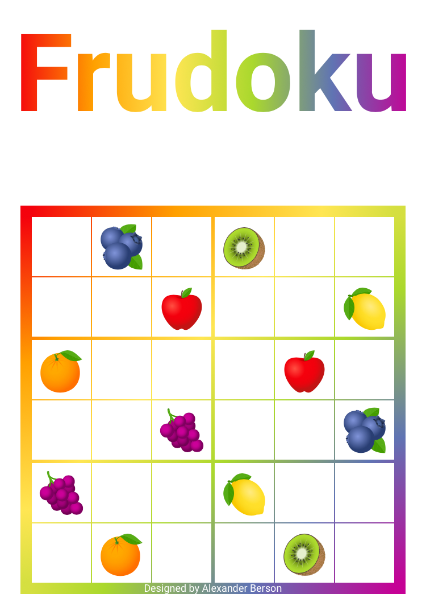

# Frudoku

Fill in the grid so that every fruit appears only once in each row, column and region.  
You can [play Frudoku online](https://alex-berson.github.io/frudoku/) or  

## Description

**Frudoku** is a logic puzzle game that is played on a grid of 6x6 squares. The goal is to fill in the empty squares with fruits so that each row, each column, and each 2x3 region contains six different fruits.

## Screenshot

  

## License

Copyright &copy; 2023 Alexander Berson. This project is licensed under the [MIT license](LICENSE.txt "MIT License"). The license applies to the software code only and does not cover the associated image files.